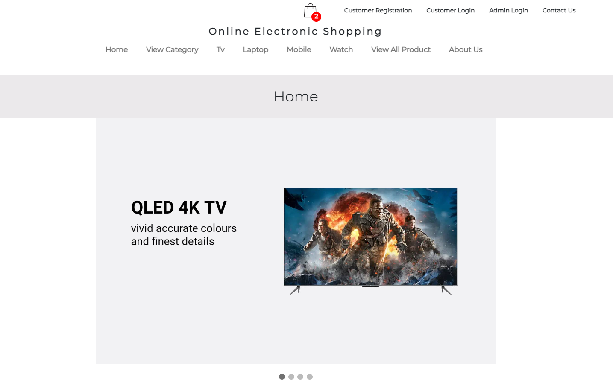

# Ecommerce Application - Java J2EE

## Author: Pavan Kumar Kondeti

---

## Project Overview
This is a full-featured Online Electronic Shopping Application built with Java J2EE, JSP, Servlets, and MySQL. It allows users to browse products, add to cart, register, login, and place orders. Admins can manage products and customers.

---

## Features
- User registration, login, and logout
- Product catalog with categories (Laptops, TVs, Mobiles, Watches)
- Add to cart and checkout
- Admin panel for product and customer management
- Contact form for customer queries
- Responsive UI with Bootstrap

---

## Technology Stack
- **Java (J2EE)**: Backend logic
- **JSP & Servlets**: Frontend and controller logic
- **HTML, CSS, Bootstrap**: UI/UX
- **MySQL**: Database
- **Tomcat**: Servlet container
- **Maven**: Dependency management

---

## Prerequisites
- Java JDK 8+
- Eclipse EE or IntelliJ IDEA
- Apache Maven
- Apache Tomcat 8.0+
- MySQL Server

---

## Setup Instructions

### 1. Clone the Repository
```
git clone <your-repo-url>
```

### 2. Database Setup (MySQL)
- Create a database named `ecommerceapp`.
- Run the provided SQL scripts (see below) to create tables and insert sample data.

### 3. Configure Database Connection
- Open `src/main/java/com/conn/DBConnect.java`.
- Update the MySQL connection string with your username and password:
```java
conn = DriverManager.getConnection(
    "jdbc:mysql://localhost:3306/ecommerceapp?useSSL=false&serverTimezone=UTC",
    "root", // your MySQL username
    "your_password" // your MySQL password
);
```

### 4. Build and Deploy
- Run:
```
mvn clean package
```
- Deploy the generated `EcommerceApp.war` to your Tomcat `webapps` directory.
- Start Tomcat and access the app at `http://localhost:8080/EcommerceApp/`

---

## MySQL Table & Data Setup

```sql
CREATE DATABASE ecommerceapp;
USE ecommerceapp;

CREATE TABLE brand (bid int DEFAULT NULL, bname varchar(50) DEFAULT NULL);
INSERT INTO brand VALUES (1,'samsung'),(2,'sony'),(3,'lenovo'),(4,'acer'),(5,'onida');

CREATE TABLE cart (Name varchar(100) DEFAULT NULL, bname varchar(50) DEFAULT NULL, cname varchar(50) DEFAULT NULL, pname varchar(50) DEFAULT NULL, pprice int DEFAULT NULL, pquantity int DEFAULT NULL, pimage varchar(200) DEFAULT NULL);

CREATE TABLE category (cid int DEFAULT NULL, cname varchar(50) DEFAULT NULL);
INSERT INTO category VALUES (1,'laptop'),(2,'tv'),(3,'mobile'),(4,'watch');

CREATE TABLE contactus (id int NOT NULL AUTO_INCREMENT, Name varchar(100) DEFAULT NULL, Email_Id varchar(100) DEFAULT NULL, Contact_No varchar(20) DEFAULT NULL, Message varchar(8000) DEFAULT NULL, PRIMARY KEY (id));

CREATE TABLE customer (Name varchar(100) DEFAULT NULL, Password varchar(20) DEFAULT NULL, Email_Id varchar(100) DEFAULT NULL, Contact_No varchar(20) DEFAULT NULL);

CREATE TABLE login (username varchar(100) DEFAULT NULL, password varchar(100) DEFAULT NULL);
INSERT INTO login VALUES ('admin','admin');

CREATE TABLE order_details (Date varchar(100) DEFAULT NULL, Name varchar(100) DEFAULT NULL, bname varchar(50) DEFAULT NULL, cname varchar(50) DEFAULT NULL, pname varchar(50) DEFAULT NULL, pprice int DEFAULT NULL, pquantity int DEFAULT NULL, pimage varchar(200) DEFAULT NULL);

CREATE TABLE orders (Order_Id int NOT NULL AUTO_INCREMENT, Customer_Name varchar(100) DEFAULT NULL, Customer_City varchar(45) DEFAULT NULL, Date varchar(100) DEFAULT NULL, Total_Price int DEFAULT NULL, Status varchar(45) DEFAULT NULL, PRIMARY KEY (Order_Id));

CREATE TABLE product (pid int NOT NULL AUTO_INCREMENT, pname varchar(50) DEFAULT NULL, pprice int DEFAULT NULL, pquantity int DEFAULT NULL, pimage varchar(200) DEFAULT NULL, bid int DEFAULT NULL, cid int DEFAULT NULL, PRIMARY KEY (pid));

-- Insert sample products here (see original README for full list)

CREATE VIEW viewlist AS select brand.bname AS bname,category.cname AS cname,product.pname AS pname,product.pprice AS pprice,product.pquantity AS pquantity,product.pimage AS pimage from ((brand join product on((brand.bid = product.bid))) join category on((product.cid = category.cid)));

CREATE VIEW mobile AS select brand.bname AS bname,category.cname AS cname,product.pname AS pname,product.pprice AS pprice,product.pquantity AS pquantity,product.pimage AS pimage from ((brand join product on((brand.bid = product.bid))) join category on((product.cid = category.cid))) where (category.cid = 3);

CREATE VIEW laptop AS select brand.bname AS bname,category.cname AS cname,product.pname AS pname,product.pprice AS pprice,product.pquantity AS pquantity,product.pimage AS pimage from ((brand join product on((brand.bid = product.bid))) join category on((product.cid = category.cid))) where (category.cid = 1);

CREATE VIEW tv AS select brand.bname AS bname,category.cname AS cname,product.pname AS pname,product.pprice AS pprice,product.pquantity AS pquantity,product.pimage AS pimage from ((brand join product on((brand.bid = product.bid))) join category on((product.cid = category.cid))) where (category.cid = 2);

CREATE VIEW watch AS select brand.bname AS bname,category.cname AS cname,product.pname AS pname,product.pprice AS pprice,product.pquantity AS pquantity,product.pimage AS pimage from ((brand join product on((brand.bid = product.bid))) join category on((product.cid = category.cid))) where (category.cid = 4);

CREATE TABLE usermaster (Name varchar(100) DEFAULT NULL, Password varchar(20) DEFAULT NULL);
INSERT INTO usermaster VALUES ('admin','admin');
```

---

## Screenshots




---

## Credits
**Author:** Pavan Kumar Kondeti

---


